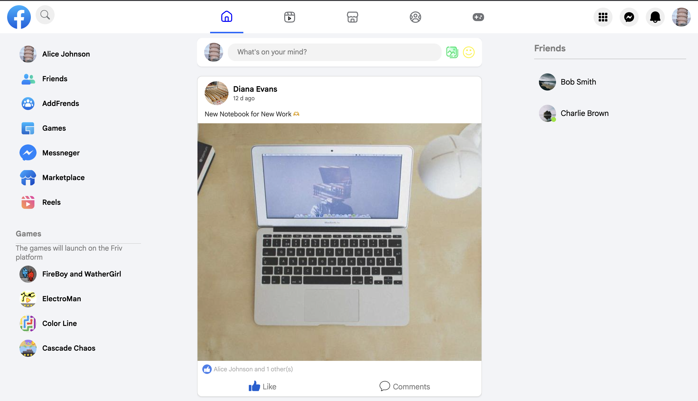
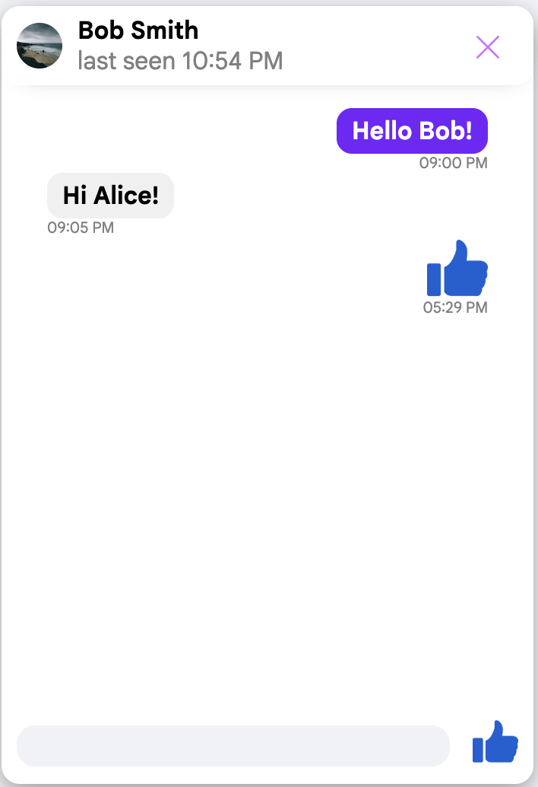
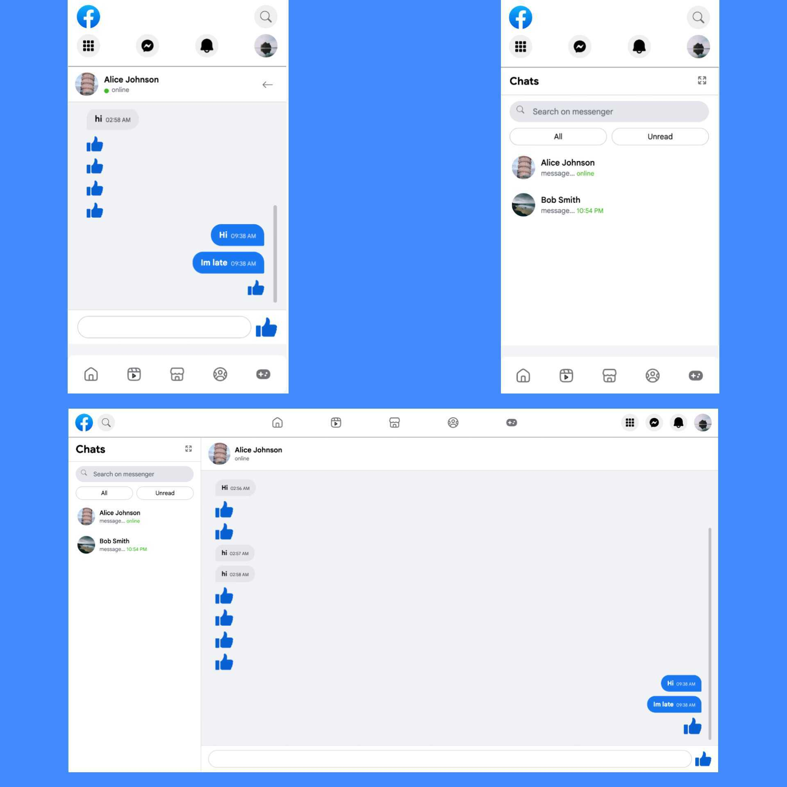
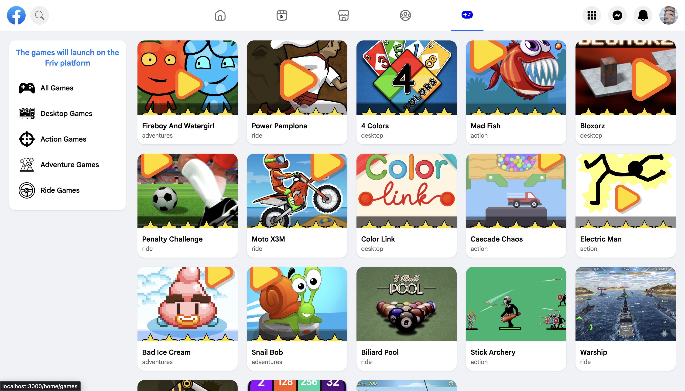

# Facebook UI Clone

⚠️ This project is currently in development.
Some features may not work yet.
A modern Facebook-style social media frontend application built with React.js.

This project is a portfolio application that recreates the core layout and functionality of Facebook, including publications, navigation, authentication system, messenger, sidebars, and interactive UI components.

!!! This project is for educational and portfolio purposes only. It is not affiliated with Meta or Facebook.

---

## Project Overview

This application simulates the main Facebook interface structure, including:

- Authentication system (Login / Sign Up)
- Navigation bar
- Left sidebar menu
- Main publications (posts feed)
- Right sidebar
- Messenger system
- Mini Messenger and Fullscreen Messenger
- Like / Comment / Send interactions
- Marketplace (currently in progress)
- Reels (in progress)

The goal of this project is to practice building a large structured frontend application using reusable components, state management, and responsive design.

---

## Authentication

### Log In

- User login form
- State-based authentication
- LocalStorage persistence
- Redirect to main page after successful login

### Sign Up (In Process)

- Registration form
- User data validation
- Will allow new users to create accounts
- Data will be stored and managed via Redux + LocalStorage

---

## Features

### General Page

- Publications (posts feed)
- Like button
- Comment system
- Send/share button
- Dynamic UI updates

### Navigation Menu

- Search people
- Reels (in progress)
- Friends
- Marketplace (in development)
- Games
- Messenger

### Sidebars

- Left sidebar (navigation & sections)
- Right sidebar (contacts / additional info)

### Messenger

- Mini Messenger (sidebar version)
  - Compact chat in sidebar
  - Shows recent contacts and messages
  - State-based rendering
  - LocalStorage persists chat history

- Fullscreen Messenger
  - Expands messenger to full-screen view
  - Easier to read and send messages
  - Audio notification for sent messages
  - Auto-scrolls to latest message
  - State-based rendering with LocalStorage persistence

- Usage:
  - Click Messenger icon to open Mini Messenger
  - Click expand button to open Fullscreen Messenger
  - Type and send messages, instantly updated and saved locally

### Data Persistence

- LocalStorage used for storing user data
- Messages stored locally
- Authentication state saved in browser

---

## Tech Stack

- **React.js**
- **JavaScript (ES6+)**
- **HTML5**
- **CSS3 (Flexbox, Responsive Design)**
- **Redux Toolkit**
- **LocalStorage API**

---

## Screenshots

### Home Page



### Messenger



### FullScreen Messenger



### Games Page



---

## Installation

### Clone the repository

```bash
git clone https://github.com/arzumanyanarshak41-dev/facebook-app.git
```
