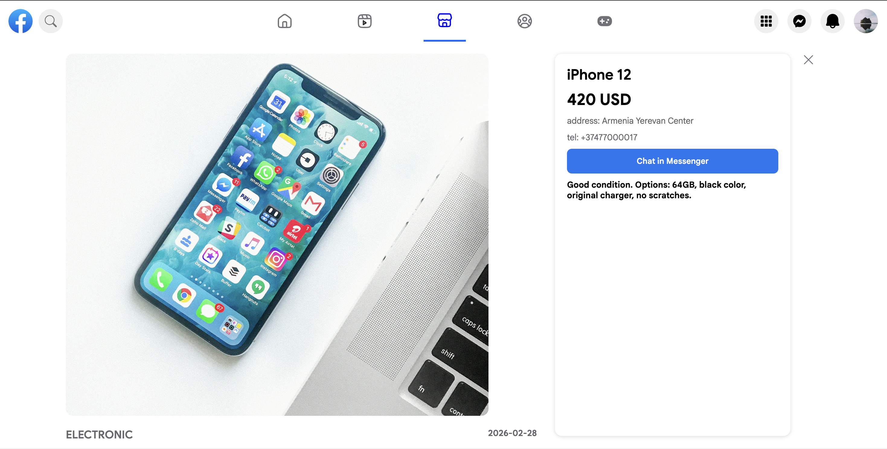

# Facebook UI Clone (in Process)

⚠️ **This project is currently in development**  
// Some features may not work yet  
**A modern Facebook-style social media frontend application built with React.js**  

**// Note:** This project is for educational and portfolio purposes only.  
**It is not affiliated with Meta or Facebook.**

---

## Project Overview

**This application simulates the main Facebook interface structure:**  

* Authentication system (Login / Sign Up)  
* Navigation bar  
* Left sidebar menu  
* Main publications (posts feed)  
* Right sidebar  
* Messenger system (Mini + Fullscreen)  
* Marketplace (Products, Listings, Filters, Search)  
* Reels (in progress)  
* Like / Comment / Send interactions  

**// Goal:** Practice building a large structured frontend application using reusable components, state management, and responsive design

---

## Components Overview

**The project uses reusable React components:**  

* **/components/GeneralMenu/** – Navigation menu icons & sections  
* **/components/Sidebars/** – Left and right sidebar elements  
* **/components/Posts/** – Post cards, comments, likes, shares  
* **/components/Messenger/** – Mini and Fullscreen Messenger  
* **/components/Marketplace/** – Product cards, product detail view, filters  
* **/components/Reels/** – Reels player (in progress)  

**// Each component manages its own state or interacts with Redux for global state management**

---

## Authentication

### Log In
* User login form  
* State-based authentication  
* LocalStorage persistence  
* Redirect to main page after successful login  

### Sign Up (In Process)
* Registration form  
* User data validation  
* Will allow new users to create accounts  
* Data will be stored via Redux + LocalStorage  

---

## Features

### General Page
* Publications feed  
* Like button  
* Comment system  
* Send / Share button  
* Dynamic UI updates  

### Navigation Menu
* Search people  
* Reels (in progress)  
* Friends  
* Marketplace (in development)  
* Games  
* Messenger  

### Sidebars
* Left sidebar (navigation & sections)  
* Right sidebar (contacts / additional info)  

### Messenger
* **Mini Messenger**  
  * Compact chat in sidebar  
  * Shows recent contacts and messages  
  * State-based rendering  
  * LocalStorage persists chat history  

* **Fullscreen Messenger**  
  * Expands messenger to full-screen view  
  * Easier to read and send messages  
  * Audio notification for sent messages  
  * Auto-scrolls to latest message  
  * State-based rendering with LocalStorage persistence  

**// Usage:**  
* Click Messenger icon → Mini Messenger  
* Click expand button → Fullscreen Messenger  
* Type and send messages → instantly updated and saved locally  

### Marketplace
* Browse products with dynamic listing  
* Search and filter items by category or price  
* View detailed product information  
* Add to cart / wishlist (planned)  
* Data managed via local JSON / LocalStorage  
* **Reusable components:** ProductCard, FilterMenu, ProductDetail  

---

## Data Persistence
* LocalStorage used for storing user data  
* Messages stored locally  
* Authentication state saved in browser  

---

## Tech Stack
* **React.js**  
* **JavaScript (ES6+)**  
* **HTML5**  
* **CSS3** (Flexbox, Responsive Design)  
* **Redux Toolkit**  
* **LocalStorage API**  

---

## Screenshots

### Home Page


### Messenger


### FullScreen Messenger


### Games Page


### Marketplace


### Products


---

## Installation

### Clone the repository
```bash
git clone https://github.com/arzumanyanarshak41-dev/facebook-app.git
cd facebook-app
npm install
npm start