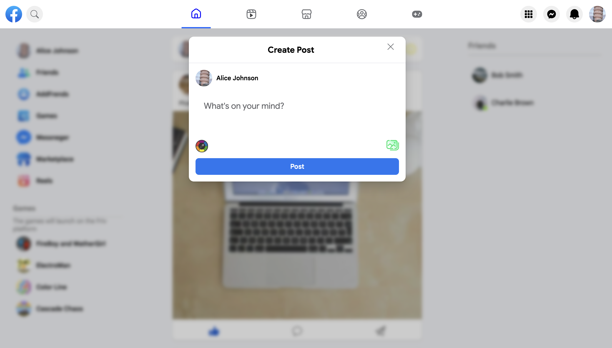
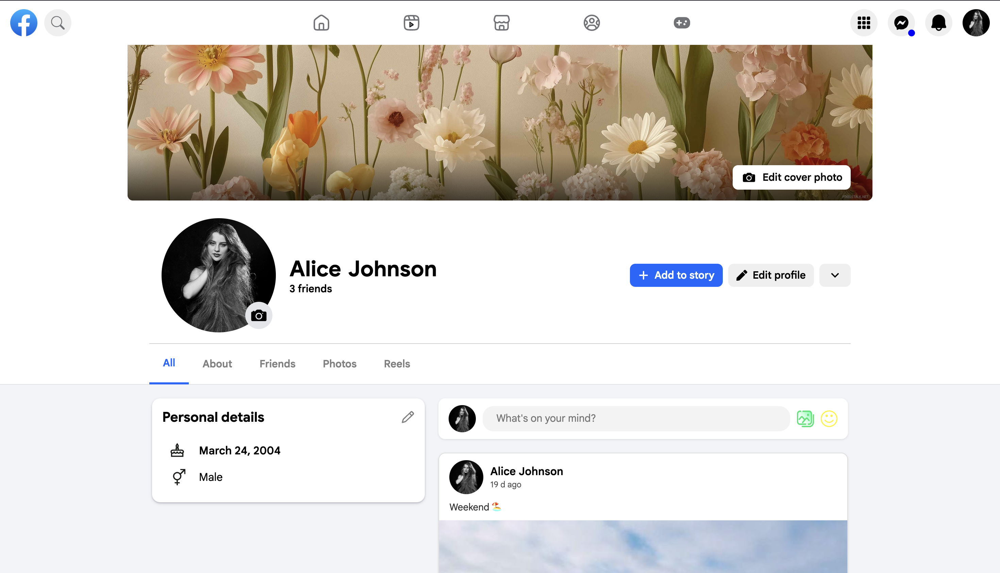

# Facebook UI Clone (in Process)

⚠️ **This project is currently in development**  
// Some features may not work yet  
**A modern Facebook-style social media frontend application built with React.js**

**// Note:** This project is for educational and portfolio purposes only.  
**It is not affiliated with Meta or Facebook.**

---

## Project Overview

**This application simulates the main Facebook interface structure:**

- Authentication system (Login / Sign Up)
- Navigation bar
- Left sidebar menu
- Main publications (posts feed)
- Right sidebar
- Messenger system (Mini + Fullscreen)
- Marketplace (Products, Listings, Filters, Search)
- Reels (in progress)
- Like / Comment / Send interactions

**// Goal:** Practice building a large structured frontend application using reusable components, state management, and responsive design

---

## Components Overview

**The project uses reusable React components organized by feature:**

- **AddPost, Publication, Comments, SendBox** – Components for creating, displaying, and interacting with posts, including comments and sending messages.
- **Messenger, FullScreenMessenger** – Mini and fullscreen messenger components with local storage and state-based rendering.
- **MarketplaceSearchedResult, CreateNewAd** – Components for Marketplace features: product listings, searching, filtering, and adding new products.
- **GeneralMenu, DropdownMenuPrimaryPage, DropdownMenuSecondaryPage, DropdownSettingMenu, GeneralRightSide** – Navigation menus, dropdowns, and sidebar menu sections.
- **UserPageMain, UserPageAbout, UserPageAll, UserPageFrends, UserPageNav, UserAbout** – User profile pages: main page, about, friends, and navigation between profile sections.
- **NavMenu, PeopleYouMeyNow, SearchGeneral, Notifications** – Additional interface components for user interactions and search features.
- **LoginPage, SignUpPage, AllPersonalDetals** – Authentication and user details components.
- **PhotoWindow** – Component for viewing photos in posts or user profiles.

**All components** manage their own state or interact with **Redux Toolkit** for global state, using **React hooks and memoization** to optimize rendering.

---

## Redux, State Management & API

- **Redux Toolkit**: Global state management for posts, users, messenger, and marketplace data.
- **Hooks & memo**: Components use custom hooks and `React.memo` for optimized rendering.
- **Mock API**: `json-server` provides fake API endpoints for posts, products, and users.
- **LocalStorage**: Persists authentication state, posts, messages, and user interactions.

---

## Authentication

### Log In

- User login form
- State-based authentication
- LocalStorage persistence
- Redirect to main page after successful login

### Sign Up (In Process)

- Registration form
- User data validation
- Allows new users to create accounts
- Data stored via Redux + LocalStorage

---

## Features

### General Page

- Publications feed
- Like button
- Comment system
- Send / Share button
- Dynamic UI updates

### Navigation Menu

- Search people
- Reels (in progress)
- Friends
- Marketplace (in development)
- Games
- Messenger

### Sidebars

- Left sidebar (navigation & sections)
- Right sidebar (contacts / additional info)

### Messenger

- **Mini Messenger**
  - Compact chat in sidebar
  - Shows recent contacts and messages
  - State-based rendering
  - LocalStorage persists chat history

- **Fullscreen Messenger**
  - Expands messenger to full-screen view
  - Easier to read and send messages
  - Audio notifications for sent messages
  - Auto-scrolls to latest message
  - State-based rendering with LocalStorage persistence

**Usage:**  
Click Messenger icon → Mini Messenger  
Click expand button → Fullscreen Messenger  
Type and send messages → instantly updated and saved locally

### Marketplace

- Browse and interact with products using **dynamic listings**
- Search and filter products by **category, price, or other attributes**
- View detailed product pages with information like **title, price, description, and seller info**
- **Reusable Components**: `ProductCard`, `FilterMenu`, `ProductDetail`
- **Data Handling**: Fetched from **local JSON / mock API**; state managed via **Redux Toolkit**; LocalStorage saves user interactions (cart/wishlist planned)

### Posts (Adding / Creation Logic)

- Users can **create new posts** with text, images, or videos
- **Post Components**: `CreatePost`, `PostCard`, `CommentsSection`
- **State Management**: Posts added to Redux store; Likes, comments, shares update dynamically
- **Persistence**: Saved in LocalStorage

---

## Data Persistence

- LocalStorage used for storing user data, posts, and messages
- Authentication state saved in browser
- Posts and marketplace interactions persist locally

---

## Tech Stack

- **React.js (with Hooks & memo)**
- **JavaScript (ES6+)**
- **Redux Toolkit**
- **HTML5 & CSS3 (Flexbox, Responsive Design)**
- **Axios / json-server** 
- **LocalStorage API**

---

## Screenshots

### Home Page


### FullScreen Messenger


### Games Page


### Marketplace


### Products


### Add Post



### User Page



---

## Installation

### Clone the repository

```bash
git clone https://github.com/arzumanyanarshak41-dev/facebook-app.git
cd facebook-app
npm install
npm start
```
